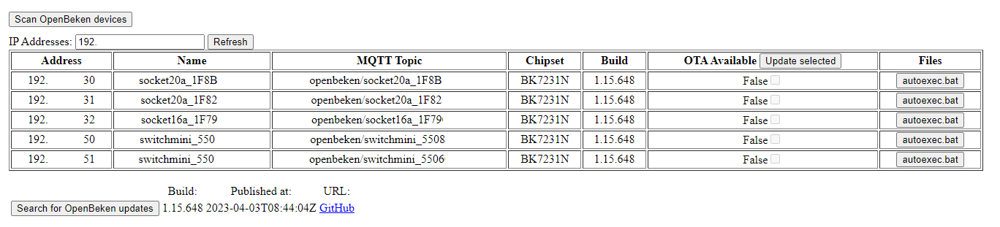

# pyOpenBeken
An easier way to manage your [OpenBeken](https://github.com/openshwprojects/OpenBK7231T_App) devices.

The purpose of this project is to ease the control of multiple devices avoiding all manual tasks.

### Features
* Send commands
* Setup mqtt & HA autodiscovery
* Read file system
* Push OTAs and restore FS
* Scan for OpenBeken devices
* Get/Set pins (Roles, Channels)
* Retrieve OpenBeken releases, pull OTA, check for changes within versions.

### TO DO:
* Create documentation 
* Add more methods and commands to interact with the boards
* ~~Ability to scan local network for OpenBeken devices (WIP).~~
* Docker container for the Web Manager?
* Control device?
* Set other options?
* You tell me


### Examples
* device: Connect to a single board:
```sh
from pyopenbeken import device
your_device = device( IP_HERE )

#Get board info
your_device.info

#Update board
your_device.check_ota()
your_device.push_ota(fileAddress)
```

* deviceManager: Connect to a series of boards by providing a list of IPs:
```sh
list_ips = [LIST OF IPS]
gh_api_token = 'GitHub API Token' or None

from pyopenbeken import deviceManager
devmgr = deviceManager(list_ips=list_ips)

#Get boards info
devmgr.devices

#Update boards
devmgr.update_devices()
```

* networkScan: Scan OpenBeken devices:
```sh
from pyopenbeken import networkScan
network = networkScan()
print('Scanning local network for IPs')
network.get_network_ips(ip_chunks_size=10)
print('Looking for OpenBeken devices')
network.obkn_api_scan(ip_chunks_size=2)
network.bkn_ips
```

* releaseManager: Retrieve OpenBeken releases:
```sh
from pyopenbeken import releaseManager
releaseMgr = releaseManager(gh_token=OPTIONAL)
releaseMgr.get_releases() or releaseMgr.get_latest()
releaseMgr.download_ota(OTA_URL) #downloads OTA
releaseMgr.check_changes(build='1.15.648') #returns changes from the provided build 'till the latest.
```

* GitHub Token:
Nobody likes to get limited by APIs quotas, you can generate a GH API token [here](https://github.com/settings/tokens?type=beta) and use it to avoid being limited.

#### Web Manager
Update your boards with just one click.
* Any help is welcome to make a convinient network scanner and a docker container =)
